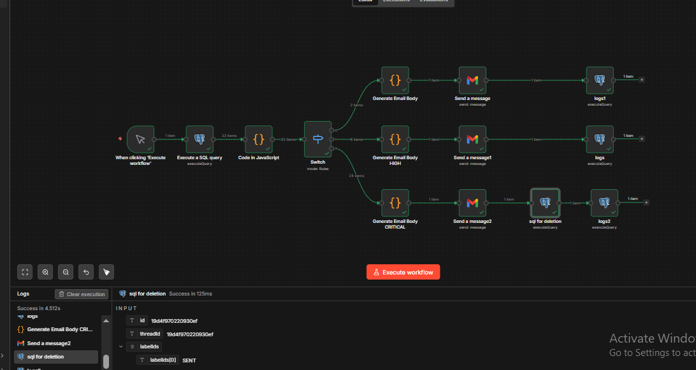
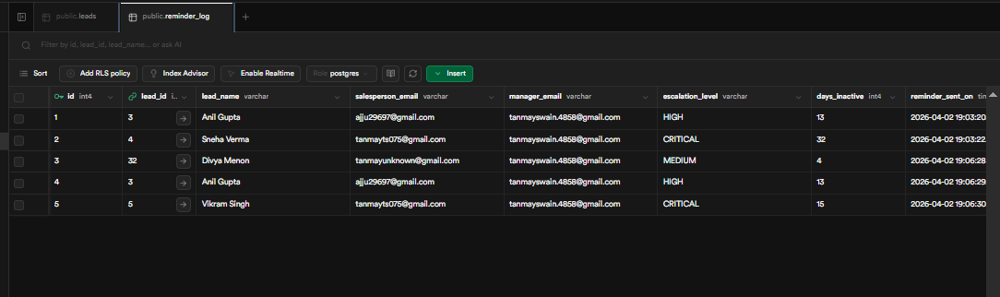
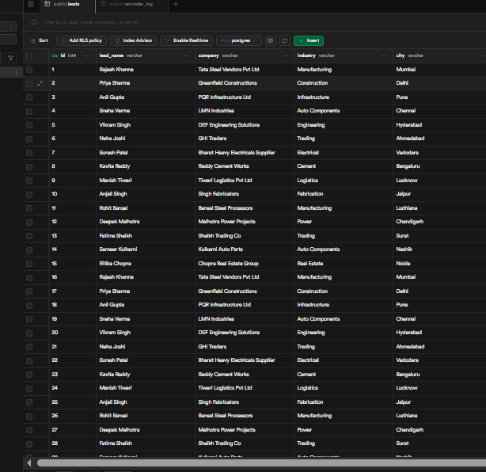
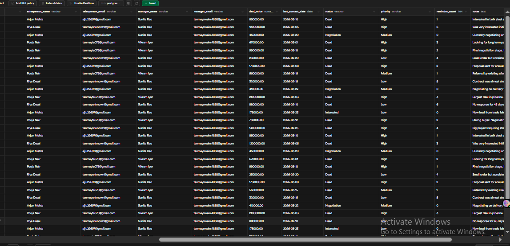

🔔 Automated Lead Follow-up Reminder System

## 📌 Problem Statement
In ERP-driven sales environments, teams manually track lead follow-ups 
using spreadsheets or CRM dashboards. This leads to missed contacts, 
cold leads, and lost deals — especially when salespersons handle 20-30 
leads simultaneously with no automated alerting system.

## ✅ Solution
Built an end-to-end automated lead follow-up reminder system using **n8n** 
connected to a **PostgreSQL database (Supabase)** that runs daily, detects 
stale leads, and triggers personalized email alerts with a three-tier 
escalation logic based on how long a lead has been inactive.

---

## ⚙️ How It Works

### Three-Tier Escalation Logic

| Urgency Level | Condition | Action |
|---|---|---|
| 🟡 MEDIUM | 3–6 days inactive | Reminder email to salesperson |
| 🔴 HIGH | 7–13 days inactive | Email salesperson + CC manager |
| ⛔ CRITICAL | 14+ days inactive | Auto-mark lead as Dead + Email manager |

### Workflow Architecture
```
Schedule Trigger (Daily 9AM)
        ↓
PostgreSQL — Fetch all active leads
        ↓
Code Node — Calculate days inactive + assign urgency level
        ↓
Switch Node — Route by urgency level
        ↓
   ┌─────────────┬──────────────┐
MEDIUM          HIGH         CRITICAL
   ↓              ↓               ↓
Generate       Generate      Generate
Email Body     Email Body    Email Body
   ↓              ↓               ↓
Gmail          Gmail          Gmail
(Salesperson)  (SP + CC Mgr)  (Manager only)
   ↓              ↓               ↓
Log to DB      Log to DB     Update lead
                              status to Dead
                                  ↓
                              Log to DB
```

---

## 🛠️ Tech Stack

| Tool | Purpose |
|---|---|
| n8n | Workflow automation and orchestration |
| PostgreSQL (Supabase) | Cloud database for leads and logs |
| Gmail | Email notifications and escalations |
| JavaScript | Custom logic in Code nodes |
| Docker | Local n8n instance setup |

---

## 🗄️ Database Schema

### `leads` table
| Column | Type | Description |
|---|---|---|
| id | int | Primary key |
| lead_name | varchar | Name of the potential customer |
| company | varchar | Lead's company name |
| industry | varchar | Industry sector |
| city | varchar | Location |
| phone | varchar | Contact number |
| salesperson_name | varchar | Assigned salesperson |
| salesperson_email | varchar | Salesperson email for reminders |
| manager_name | varchar | Manager name |
| manager_email | varchar | Manager email for escalations |
| deal_value | numeric | Deal size in INR |
| last_contact_date | date | Date of last follow-up |
| status | varchar | Interested / Negotiation / Proposal Sent / Dead |
| priority | varchar | High / Medium / Low |
| reminder_count | int | Total reminders sent so far |
| notes | text | Context notes about the lead |
| created_at | date | When lead was added |

### `reminder_log` table
| Column | Type | Description |
|---|---|---|
| id | int | Primary key |
| lead_id | int | Foreign key referencing leads |
| lead_name | varchar | Name of the lead |
| salesperson_email | varchar | Who was notified |
| manager_email | varchar | Manager who was CC'd or alerted |
| escalation_level | varchar | MEDIUM / HIGH / CRITICAL |
| days_inactive | int | Days since last contact at time of alert |
| reminder_sent_on | timestamp | Exact time reminder was triggered |

---

## 📸 Screenshots

### Complete n8n Workflow


### Leads Database (Supabase)


### Reminder Log (Auto-populated after workflow runs)


### Sample Email Received


---

## 🔄 Workflow Node Breakdown

**1. Schedule Trigger**
Fires every day at 9:00 AM automatically.

**2. PostgreSQL — Execute SQL Query**
Fetches all leads from the database where status is not already Dead.

**3. Code Node — Calculate Staleness**
Loops through every lead, calculates days since last contact using 
today's date, assigns urgency level (MEDIUM / HIGH / CRITICAL), 
and filters out leads that don't need attention.

**4. Switch Node — Route by Urgency**
Routes each lead to the correct branch based on urgency level.

**5. Code Nodes — Generate Email Body**
Dynamically generates personalized email content for each lead 
using lead name, company, deal value, days inactive, and status.

**6. Gmail Nodes — Send Emails**
Sends reminder emails to salesperson (MEDIUM), salesperson + CC 
manager (HIGH), or manager only (CRITICAL).

**7. PostgreSQL — Update Lead Status**
For CRITICAL leads, automatically updates status to Dead in the 
database.

**8. PostgreSQL — Log to reminder_log**
Inserts a record into reminder_log table for every reminder sent, 
creating a full audit trail.

---

## 💡 Future Improvements
- Direct integration with Zoho CRM API instead of PostgreSQL
- WhatsApp notifications via Twilio for faster reach
- Dashboard to visualize lead pipeline health and reminder history
- AI-generated personalized email content using LLM APIs
- Cloud deployment of n8n for 24/7 automated running

---

## 🚀 How to Run Locally

**Prerequisites:**
- Docker installed
- Supabase account with leads table set up
- Gmail account connected to n8n

**Steps:**
1. Run n8n using Docker:
```bash
docker run -it --rm --name n8n -p 5678:5678 \
  -v n8n_data:/home/node/.n8n \
  docker.n8n.io/n8nio/n8n
```
2. Open `http://localhost:5678`
3. Import `automation-workflow.json` into n8n
4. Set up PostgreSQL and Gmail credentials
5. Click Execute Workflow to test

